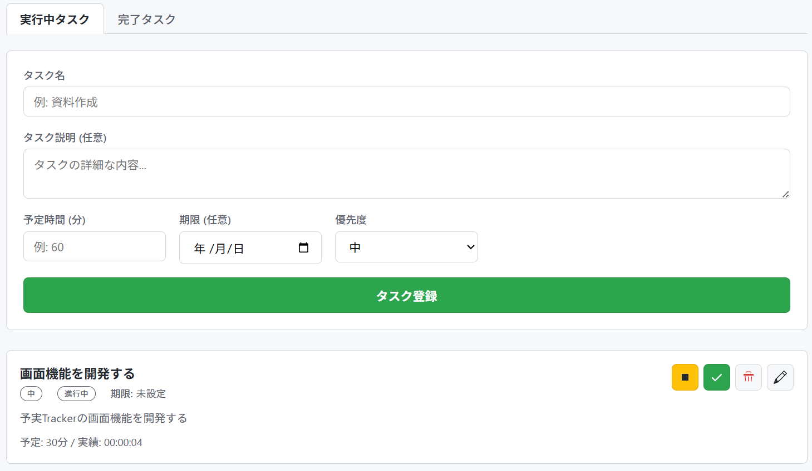
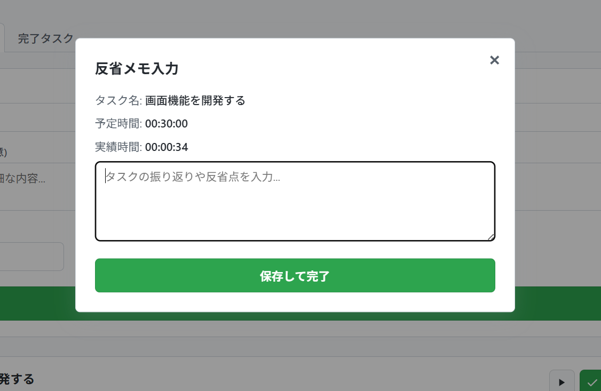

# 予実Tracker
TODOアプリを拡張して、各タスクの予実を正確にモニタリングできるようにすることで、予実とそこからの改善のサイクルを自然と回せるようにするWebアプリケーション

アジャイル的に段階的に機能を増やしていく想定で、最終的にタスクのブレークダウンから、優先順位管理、予実の情報を用いたデータ分析までを行えるようにする予定。

現在はそのversion1（[develop/v1](https://github.com/utibori-jp/yojitsu-tracker/tree/develop/v1)）を開発中。（version1の完成イメージは、[こちら](https://utibori-jp.github.io/yojitsu-tracker/)）

version1では、シンプルなTODOアプリに、時間測定機能及び、タスク完了時にメモを記載できる画面を追加したものを作成する。

**タスクに時間測定機能を追加する**

**タスク完了時にメモを記載する**

